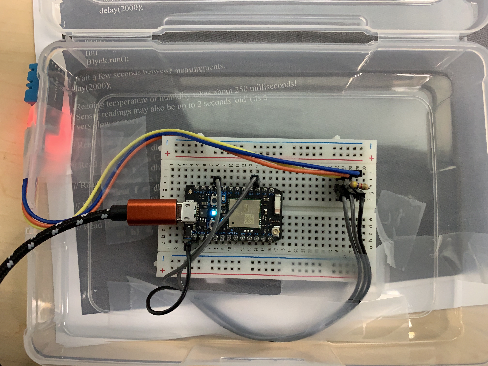
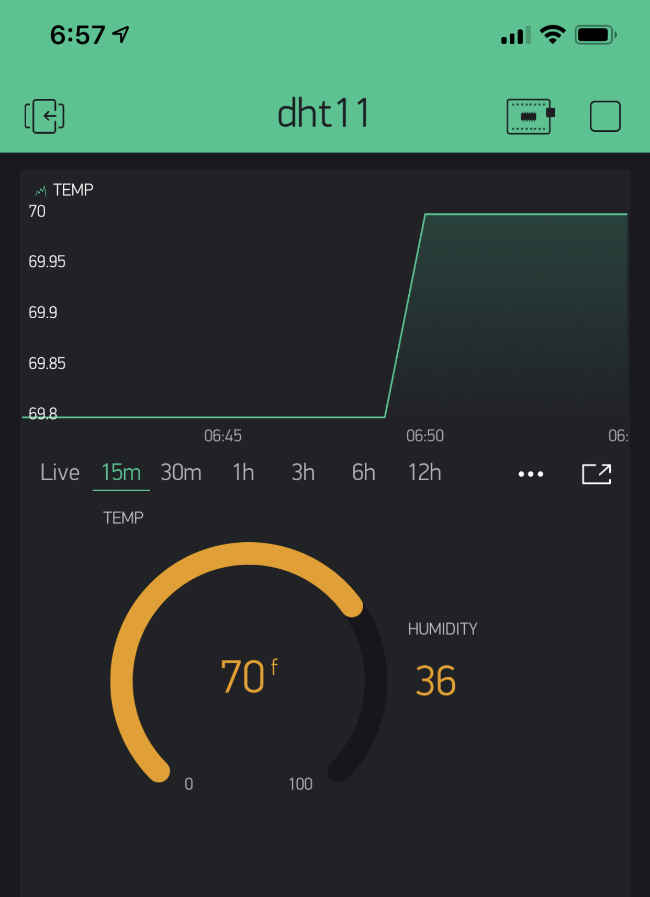

<!---
[click here](https://particle.hackster.io/gusgonnet/temperature-humidity-monitor-with-blynk-7faa51)
--->
## Monitor Temp & Humidity

Required Parts:
<br>- Particle Photon
<br>- DHT11 Sensorf [link](https://www.amazon.com/gp/product/B01H3J3H82/ref=ppx_yo_dt_b_asin_title_o06_s01?ie=UTF8&psc=1)
<br>- OPTIONAL: PowerShield (Battery) [link](https://www.amazon.com/gp/product/B06XJ64G8G/ref=ppx_yo_dt_b_asin_title_o02_s00?ie=UTF8&psc=1)
<br>- OPTIONAL: PowerShield (Battery) [link](https://www.amazon.com/gp/product/B06XJ64G8G/ref=ppx_yo_dt_b_asin_title_o02_s00?ie=UTF8&psc=1)
<!---
[link](https://docs.particle.io/tutorials/hardware-projects/maker-kit/#tutorial-3-conference-room-monitor)
--->

### Step 1: SETUP WIFI & RESET PHOTON

<a href="https://iotrvc.github.io/reset/" target="blank">Click Here</a>

### Step 2: Connect Temperature Sensor & Resistor to Photon
- Connect your sensor onto the Photon. Follow these examples for hooking up common sensors.

```
Sensor Pin  | Photon Pin
       pin1 | VIN (on the left) of the sensor to +5V
       pin2 | D2 middle pin
       pin3 | D0 (on the right) of the sensor to GROUND
       Connect a 10K resistor from pin 2 (data) to pin 1 (power) of the sensor
       
```

#### Set up the hardware

Should look like this


<br>

<br>
<hr>

### Step 3: Setup BLYNK APP

- Download iOS or Android App and setup account on BLYNK (link)[https://blynk.io/en/getting-started]
- Log In to Blynk app and press QR button in Projects gallery & SCAN BELOW QR CDOE TO GET PROJECT

- Connect Blynk App to Photon: Tap on Octagon Icon and add your photon under devices

<br>

### Step 4: Create Particle App

- Go to https://build.particle.io/build/new 
- Title: Monitor_Temperature_Humidity
- Add Library: Adafruit_DHT_Particle
- Add Library: blynk
- Paste Below Code

```cpp
// This #include statement was automatically added by the Particle IDE.
#include "Adafruit_DHT_Particle.h"
#include "blynk.h"

//Temp / Humditity using DHT11 sensor
// Written by Chuck Konkol public domain

#define DHTPIN D2     // what pin we're connected to

// Uncomment whatever type you're using!
//#define DHTTYPE DHT11		// DHT 11 
#define DHTTYPE DHT11		// DHT 22 (AM2302)
//#define DHTTYPE DHT21		// DHT 21 (AM2301)

// Connect pin 1 (on the left) of the sensor to +5V
// Connect pin 2 of the sensor to whatever your DHTPIN is
// Connect pin 4 (on the right) of the sensor to GROUND
// Connect a 10K resistor from pin 2 (data) to pin 1 (power) of the sensor

DHT dht(DHTPIN, DHTTYPE);

//DANGER - DO NOT SHARE!!!!
char auth[] = "BLYNKTOKENHERE"; // Put your blynk token here
bool run;

void setup() {
     Blynk.begin(auth);
	Particle.publish("state", "DHT11 test start");
    run = true;
	dht.begin();
	delay(2000);
}

void loop() {
    run = true;
    Blynk.run();
  
// Wait a few seconds between measurements.
delay(2000);

// Reading temperature or humidity takes about 250 milliseconds!
// Sensor readings may also be up to 2 seconds 'old' (its a 
// very slow sensor)

// Read Humidity 
	float h = dht.getHumidity();
// Read temperature as Celsius
	float t = dht.getTempCelcius();
// Read temperature as Farenheit
	float f = dht.getTempFarenheit();
// Read Farenheit as int to test later 	
	int t1 = dht.getTempFarenheit();
// Read Humidity as int (not using)	
	int h1 =  dht.getHumidity();

//Particle.publish("temps",  String(t1));
  
// Check if any reads failed and exit early (to try again).
	if (isnan(h) || isnan(t) || isnan(f)) {
		Serial.println("Failed to read from DHT sensor!");
        run = false;
	}
	
// Compute heat index
// Must send in temp in Fahrenheit!
if (run == true){
// Read HeatIndex 
    float hi = dht.getHeatIndex();
// Read DewPoint 
	float dp = dht.getDewPoint();
// Read TempKelvin 
	float k = dht.getTempKelvin();
//Publish all reading to log
Particle.publish("readings", String::format("{\"Hum(\%)\": %4.2f, \"Temp(°F)\": %4.2f, \"DP(°C)\": %4.2f, \"HI(°C)\": %4.2f}", h, f, dp, hi));

//Set int Fahrenheigt and Humidity to String
   String sf(f, 0);
   String sh(h, 0);
//virtual pin 1 will be the temperature (int)  
    Blynk.virtualWrite(V1, sf);
     Particle.publish("Temp(F)", sf);
//virtual pin 2 will be the humidity (int)
    Blynk.virtualWrite(V2, sh);
     Particle.publish("Humidity", sh);
//pause 2 seconds
    delay(2000);
}else{
     run = true;
     //if temp above 100 or below 30 then publish false reading (caused by noise)
     //Particle.publish("errors", String(t1));
     delay(2000);
}
	delay(10000);
}

```

#### MonitorTemperature_Humidity
Get App Code: <a href="https://go.particle.io/shared_apps/5cf26c179169f70005bf3085" target="blank">Click Here</a>

- Click Save
- Click Flash

That’s It! You should now see updates in Blynk App


### TROUBLESHOOTING STEPS
<a href="https://iotrvc.github.io/troubleshooting/" target="blank">Click Here For TroubleShooting Steps</a>

